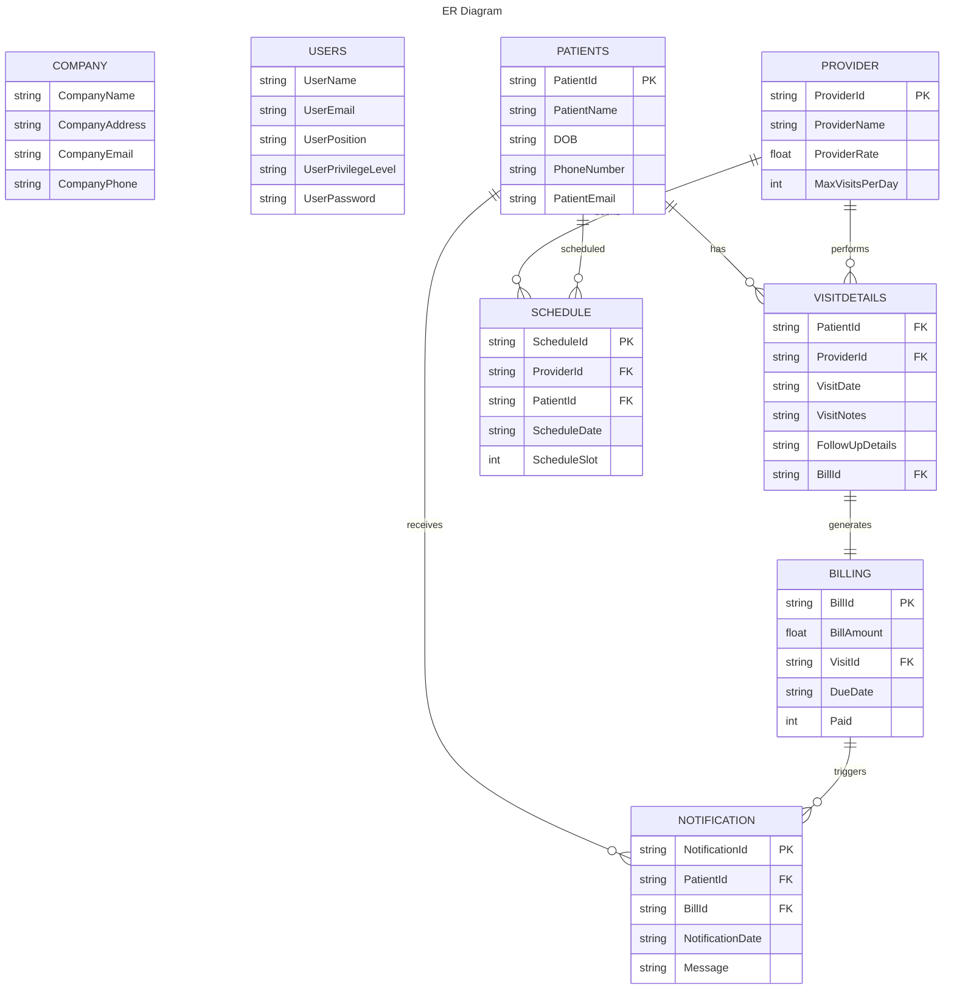

```mermaid
---
title: ER Diagram
---
erDiagram
    COMPANY {
        string CompanyName
        string CompanyAddress
        string CompanyEmail
        string CompanyPhone
    }
    USERS {
        string UserName
        string UserEmail
        string UserPosition
        string UserPrivilegeLevel
        string UserPassword
    }
    PATIENTS {
        string PatientId PK
        string PatientName
        string DOB
        string PhoneNumber
        string PatientEmail
    }
    PROVIDER {
        string ProviderId PK
        string ProviderName
        float ProviderRate
        int MaxVisitsPerDay
    }
    VISITDETAILS {
        string PatientId FK
        string ProviderId FK
        string VisitDate
        string VisitNotes
        string FollowUpDetails
        string BillId FK
    }
    BILLING {
        string BillId PK
        float BillAmount
        string VisitId FK
        string DueDate
        int Paid
    }
    NOTIFICATION {
        string NotificationId PK
        string PatientId FK
        string BillId FK
        string NotificationDate
        string Message
    }
    SCHEDULE {
        string ScheduleId PK
        string ProviderId FK
        string PatientId FK
        string ScheduleDate
        int ScheduleSlot
    }

    PATIENTS ||--o{ VISITDETAILS : has
    PROVIDER ||--o{ VISITDETAILS : performs
    PATIENTS ||--o{ NOTIFICATION : receives
    BILLING ||--o{ NOTIFICATION : triggers
    VISITDETAILS ||--|| BILLING : generates
    PROVIDER ||--o{ SCHEDULE : books
    PATIENTS ||--o{ SCHEDULE : scheduled
```
